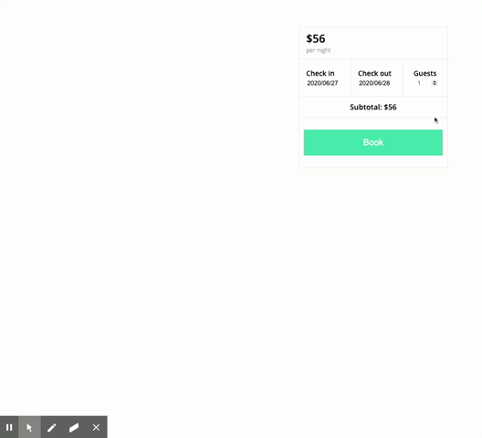

# bookingservice
Booking module for making reservation

## initial setup
Run these commands in order
1. npm install
2. npm run mysql (password set to 'root' in package.json script)
3. npm run db:setup

## launching
Run these commands in order
1. npm run build
2. npm run start

## demo
